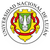
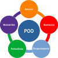

# Programación Orientada a Objetos (11076) - UNLu

## Docentes

### Profesor Responsable
* Lic. Walter Panessi

### Equipo de Práctica

* Comisión **Luján** (6)
    * Lic. Pablo Tomás Delvechio
    * Lic. Andrés Giordano
    * AS. Federico Radeljak
* Comisión **CR Chivilcoy** (35)
    * Lic. Pablo Cesar Chale
    * Lic. Santiago Ricci

## Información Importante

[Programa Oficial Vigente](http://www.certificaciones.unlu.edu.ar/sites/www.certificaciones.unlu.edu.ar/files/site/Programas/17/11076_0.pdf)

[Cronograma del Curso](https://docs.google.com/spreadsheets/d/1U3SC8EQSxzVnjx0JkAOUvprYMrZqKsqOhVp4kZLWyZc/edit?usp=sharing)

## Trabajos Prácticos

[TP 1 - Intro POO / Ligas, Asociaciones y Relaciones](tp1.md)
Fecha de Entrega: 06 / 09 / 2023

[TP 2 - Referencias e Instancias / Herencia y Polimorfismo](tp2.md)
Fecha de Entrega: 27 / 09 / 2023
